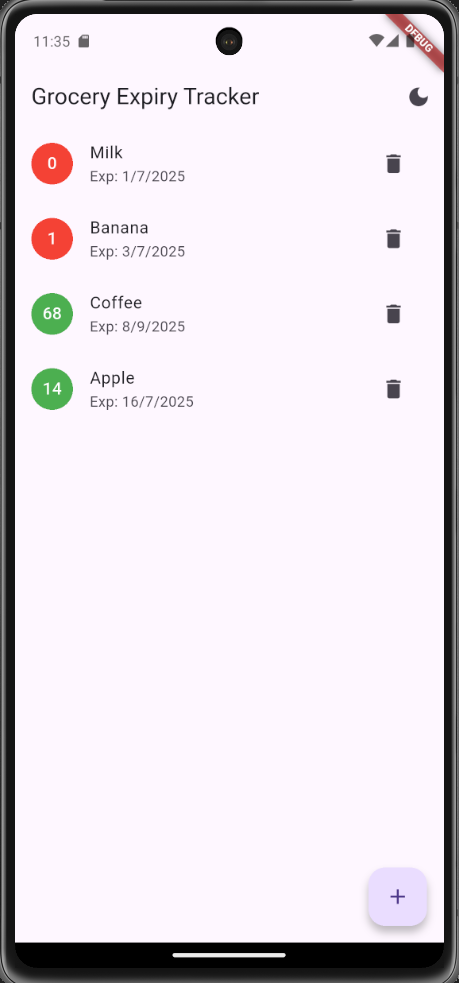
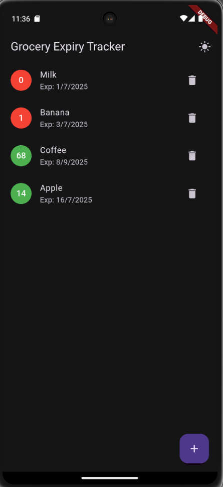

# 🛒 Grocery Reminder App

A simple and intuitive Flutter application that helps users track grocery items with expiry dates and receive reminders before they expire.

---

## 📱 Features

- ✅ Add grocery items with expiry dates  
- 📋 View list of added items  
- 🗓️ See how many days are left before expiry  
- 🟥 Red indicator for items expiring in 1 day  
- 🟩 Green indicator for safe items  
- 💾 Local data storage using Hive  
- 🔔 Daily local notifications one day before expiry (optional bonus)  
- 🌗 Light/Dark theme toggle (bonus)

---

## 📂 Project Structure

lib/
├── main.dart
├── models/
│   └── grocery_item.dart
├── services/
│   ├── notification_service.dart
│   └── storage_service.dart
├── widgets/
│   ├── add_item_dialog.dart
│   └── grocery_list_item.dart
└── screens/
    └── home_screen.dart
    └── theme_provider.dart

## 🚀 Getting Started

### 1. Clone the repo

```bash
git clone https://github.com/Shweta-281/grocery_reminder.git
cd grocery_reminder

2. Install dependencies

flutter pub get

3. Generate Hive adapter

dart run build_runner build --delete-conflicting-outputs

flutter run


🛠️ Technologies Used
Flutter

Hive (Local storage)

Provider (State management)

Flutter Local Notifications

SharedPreferences

Material Design

📸 Screenshots



📦 Packages Used
| Package                       | Purpose                      |
| ----------------------------- | ---------------------------- |
| hive / hive\_flutter          | Local storage for items      |
| provider                      | Light/Dark theme management  |
| flutter\_local\_notifications | Local reminders              |
| shared\_preferences           | Store theme preferences      |
| intl / timezone               | Date formatting + time zones |

🙋‍♀️ Author
Shweta Salunkhe

